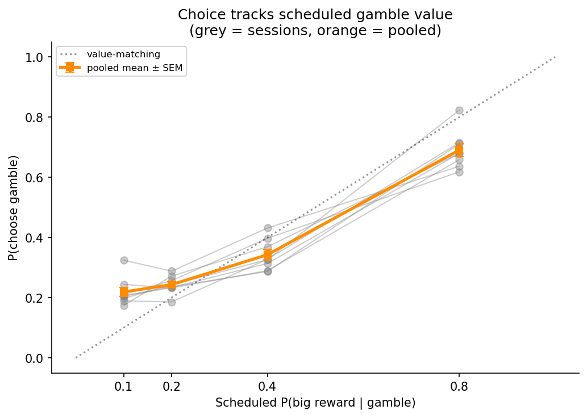
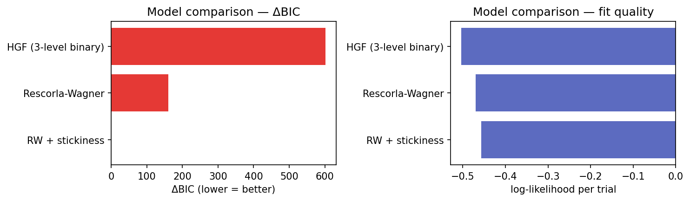
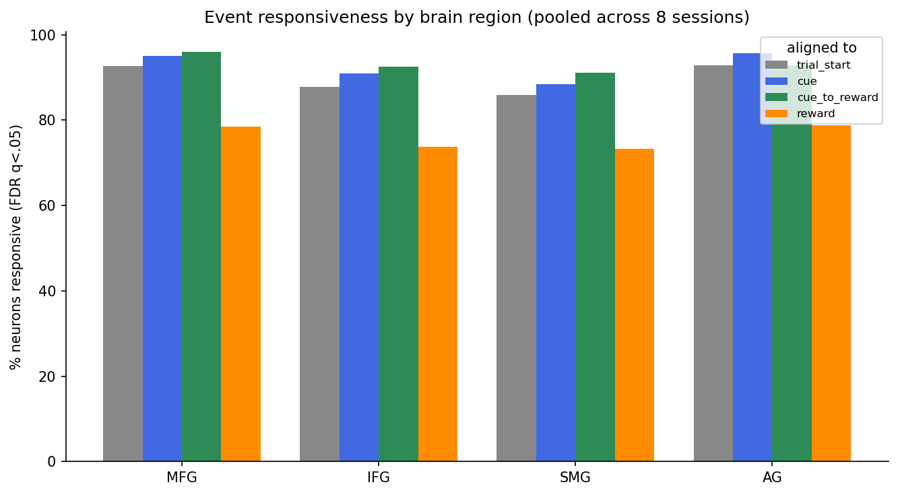
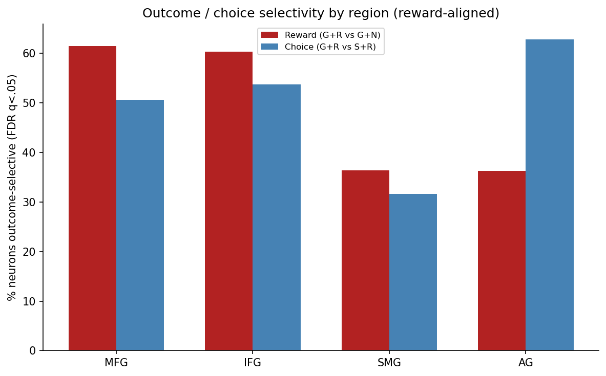
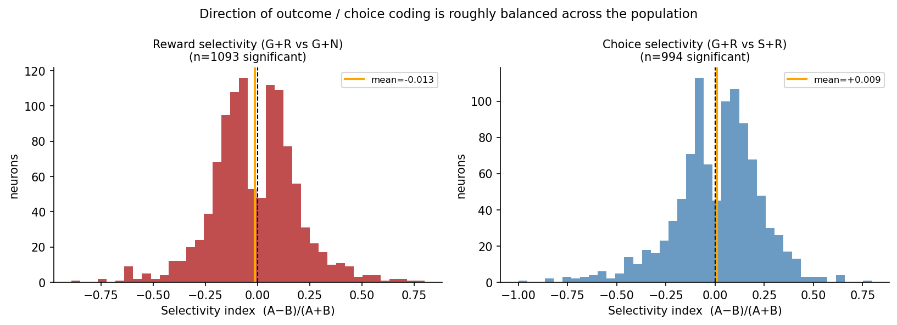

# Reward Encoding in the Human Brain During Risky Choice
### A cross-session exploratory report — Human Data project, Simon Jacob's lab

**Author:** Claude Code (exploratory analysis) · **Date:** 2026-06-10
**Data:** 8 intracranial recording sessions, single participant, two-armed risky-choice task
**Companion files:** all tables in `results/report/*.csv`; figures referenced inline.
**Independent verification:** every headline number in this report was re-derived from
raw data by three independent Sonnet sub-agents (see §9). All passed.

---

## 1. Executive summary

A single neurosurgical patient performed a two-armed risky-choice task (a **Gamble**
arm whose pay-out probability drifts in blocks, versus a **Safe** arm that pays a small
certain reward) while **1,845 units** were recorded across **8 sessions** from four
cortical regions (middle frontal gyrus MFG, inferior frontal gyrus IFG, supramarginal
gyrus SMG, angular gyrus AG). This report explores the dataset end-to-end — behaviour,
computational models of learning, and single-unit reward coding — and distils the
findings into testable hypotheses.

**Six headline findings:**

1. **The participant is a near-perfect value tracker.** P(choose gamble) rises
   monotonically with the scheduled gamble probability (0.22 → 0.24 → 0.34 → 0.69 across
   P = 0.1, 0.2, 0.4, 0.8); the within-session correlation between scheduled value and
   choice is **r = 0.98**.

2. **…but markedly risk-averse.** Even when the gamble's expected value is 3.2× the safe
   reward (P = 0.8, reward ratio 4:1), the gamble is chosen only **69%** of the time. The
   indifference point sits near P ≈ 0.55, far above the EV-neutral point of P = 0.25.

3. **Choice is dominated by perseveration ("stickiness").** Win-stay (0.93) vastly
   exceeds lose-shift (0.58). Consequently, a **Rescorla–Wagner model with a stickiness
   term beats both plain RW and the 3-level HGF** by a large margin (ΔBIC = 160 and 601,
   respectively). Hierarchical Bayesian volatility tracking is *not* needed to explain
   this participant's choices.

4. **About half the population carries trial-outcome information.** ~52% of units
   distinguish rewarded from unrewarded gamble outcomes; ~46% distinguish gamble from
   safe choices (reward-aligned, FDR q < 0.05).

5. **A regional double dissociation.** Reward-outcome coding is **frontal-dominant**
   (MFG 62%, IFG 60% ≫ SMG 36%, AG 36%), whereas choice coding is **strongest in angular
   gyrus** (AG 63% > IFG 54% > MFG 51% > SMG 32%). This is the report's strongest,
   most artifact-resistant neural result.

6. **Reward responses are fast and bidirectional.** Median peak-onset after reward
   onset is **67 ms**; the direction of outcome coding is roughly balanced across the
   population (≈47% of significant units fire *more* for reward, ≈53% fire more for
   omission).

A methodological caveat threads through the neural results: one-sample "responsiveness"
to events is ~90% of units, which the verification agent and I both judge to be partly
an artifact of an extremely sensitive test (ZETA vs. a uniform null with ~30k spikes per
unit). The **two-sample contrasts** (findings 4–6) cancel that baseline and are the
numbers to trust.

---

## 2. Dataset and methods

### 2.1 Task

Each trial the participant chooses between a **Gamble** arm (probability of the big
reward = `P_BigReward_Gamble`, which steps between **{0.1, 0.2, 0.4, 0.8}** in blocks of
~25 trials) and a **Safe** arm (scheduled probability 1.0 of a small certain reward).
Reward *magnitudes* are not stored in the exports (the amount columns are entirely NaN
in all 8 sessions — confirmed); the modelling layer therefore hard-codes the canonical
task ratio **R_gamble = 4, R_safe = 1**. Choice is read from column 13 (`ChosenArm`,
Gamble = 1/Safe = 0); column 12 (`ChosenSide`) is unreliable per the README and is not
used. Non-responding trials (`NotResponding = 1`) are excluded throughout.

### 2.2 Recordings

Spike times (already sorted; `STMtx.mat`, seconds, NaN-padded) at SR = 30 kHz. Units are
labelled `unit<id> | <REGION> ele<elec> (su|mu)`. The 8 sessions are weeks apart with
re-randomised schedules, so the modelling resets beliefs at each session boundary.

### 2.3 Inventory (verified)

| Session | Trials (responding) | Units (su/mu) | Rec. (min) | Gamble rate | Reward rate | Blocks |
|---|---|---|---|---|---|---|
| 20250521 | 1009 (939) | 252 (180/72) | 116 | 0.42 | 0.77 | 36 |
| 20250602 | 1018 (947) | 214 (152/62) | 118 | 0.36 | 0.81 | 36 |
| 20250605 | 1037 (962) | 241 (167/74) | 143 | 0.35 | 0.82 | 36 |
| 20250703 | 635 (507) | 215 (165/50) | 70 | 0.33 | 0.81 | 19 |
| 20250707 | 911 (772) | 220 (167/53) | 129 | 0.38 | 0.81 | 30 |
| 20250709 | 694 (639) | 225 (184/41) | 105 | 0.37 | 0.81 | 26 |
| 20250710 | 984 (902) | 249 (191/58) | 135 | 0.36 | 0.81 | 36 |
| 20250714 | 1006 (959) | 229 (180/49) | 116 | 0.40 | 0.80 | 36 |
| **Total** | **7294 (6627)** | **1845 (1386/459)** | — | **0.37** | **0.80** | — |

Pooled region counts: **MFG 702, SMG 561, IFG 469, AG 113.** Single units are 75% of the
sample. The full table is `results/report/session_inventory.csv`.

### 2.4 Analysis pipeline

Behaviour and modelling were computed fresh for this report (`scripts/report_*.py`);
the single-unit statistics reuse the lab's existing ZETA pipeline, whose per-session,
per-neuron outputs (`results/neuron_summary_*.csv`) were aggregated and FDR-corrected
(`scripts/report_neural_aggregate.py`). ZETA (Zenith of Event-based Time-locked
Anomalies) is a parameter-free test: the **one-sample** form asks whether spike timing
deviates from uniform around an event (responsiveness); the **two-sample** form asks
whether the reward-aligned response *differs between two trial types* (selectivity).
Multiple comparisons were controlled with Benjamini–Hochberg FDR applied within each
(session × test).

---

## 3. Behaviour I — the participant tracks value but is risk-averse

*Figure 1. P(choose gamble) as a function of the scheduled gamble win-probability.
Grey = the 8 individual sessions; orange = pooled mean ± SEM; dotted = the
"value-matching" identity line.*

The choice curve is the cleanest behavioural signature in the dataset. Pooled across
sessions:

| Scheduled P(big \| gamble) | 0.1 | 0.2 | 0.4 | 0.8 |
|---|---|---|---|---|
| P(choose gamble) | 0.22 ± 0.04 | 0.24 ± 0.03 | 0.34 ± 0.05 | 0.69 ± 0.06 |

The monotonic rise, reproduced in **every** session (within-session r = 0.98 ± 0.02),
shows the participant has correctly inferred the rank order of the four contingencies and
graded choice accordingly — they are not choosing randomly or by a fixed habit.

**Yet they leave expected value on the table.** With the canonical 4:1 magnitude ratio,
the gamble's expected value equals the safe value at P = 0.25; above that, gambling is
the EV-maximising action. At P = 0.4 (EV = 1.6 vs 1.0) the participant gambles only 34%
of the time, and even at P = 0.8 (EV = 3.2) only 69%. The behavioural **indifference
point (50% gamble) lies near P ≈ 0.55** — roughly *double* the EV-neutral probability.
This is a textbook **risk-averse utility curve**: large, reliable subjective discounting
of the uncertain option. The participant's overall gamble rate is 0.37, i.e. they take
the Safe arm ~63% of the time. The HGF response model captures the same fact as a
strongly **negative choice bias** (−0.7 to −1.2 in every session; §5).

> **Caveat on the reward ratio.** Because magnitudes are NaN in the data, the *exact*
> location of the EV-neutral point depends on the true 4:1 assumption. The *qualitative*
> conclusion (gambling is sub-EV-optimal at high P) holds for any ratio ≤ ~5:1; only the
> precise degree of risk aversion is ratio-dependent.

---

## 4. Behaviour II — choice is dominated by perseveration

The second behavioural signature is **stickiness**. Conditioning on the previous gamble
outcome:

| Statistic | Definition | Value (mean ± SD across sessions) |
|---|---|---|
| **Win-stay** | repeat Gamble after a gamble **win** | **0.93 ± 0.04** |
| **Lose-shift** | switch to Safe after a gamble **loss** | **0.58 ± 0.04** |

The asymmetry is the important part. A purely value-driven agent would show symmetric
sensitivity to wins and losses; this participant **clings to the gamble after a win
(93%) but only abandons it after a loss 58% of the time.** That signature — strong
self-perseveration partly decoupled from outcome — is exactly what a *choice-kernel /
stickiness* term models, and it explains the model-comparison result in §5.

Two further behavioural notes:

- **Belief coupling.** A rolling estimate of the gamble's recent pay-out rate (last 10
  gamble trials) correlates with choosing gamble at r = 0.33 ± 0.07 — present but
  modest, consistent with choice being driven by a *mixture* of tracked value and
  perseveration rather than value alone.
- **Engagement varies.** Session 20250703 has 20% non-responding trials (double the
  others) and the lowest gamble rate (0.33); it is also the shortest session. Treat its
  per-session estimates with extra caution.

The full per-session behavioural panel is in
`../figures/behaviour_overview_all.png` (choice rasters with the block-wise probability
schedule overlaid), and the metrics table is `results/report/behaviour_metrics.csv`.

---

## 5. Computational modelling — simple RL beats the hierarchical Bayesian model

The lab's HGF layer (`analysis/hgf/`) fits a **3-level binary Hierarchical Gaussian
Filter** that tracks the gamble win-probability (level 2) and its volatility (level 3),
with a sigmoid response model `P(gamble) = σ(β·(p̂·4 − 1) + bias)`. It is compared against
**Rescorla–Wagner** and **RW + stickiness** on identical trials and an identical response
model (only the belief-update rule differs).

*Figure 2. ΔBIC relative to the best model (lower = better). RW + stickiness wins.*

| Model | k | log-lik | BIC | ΔBIC |
|---|---|---|---|---|
| **RW + stickiness** | 4 | −3030.3 | **6095.8** | **0** |
| Rescorla–Wagner | 3 | −3114.8 | 6256.1 | +160 |
| HGF (3-level binary) | 3 | −3335.4 | 6697.2 | +601 |

The verification agent **recomputed every BIC from `k·ln(6627) − 2·loglik`** and confirmed
the ranking, the identical trial count across models, and that the priors do not leak into
the likelihood — i.e. the comparison is genuinely apples-to-apples. **The HGF is the worst
of the three.** The stickiness term pays for its extra parameter many times over,
matching the behavioural finding that perseveration drives choice.

**Interpretation.** For this participant and task, choices are better described by
**model-free reinforcement learning with choice perseveration** than by hierarchical
inference about environmental volatility. This is plausible on task grounds: the gamble
contingency is *piecewise constant within blocks*, so there is little genuine volatility
to track — a single learning rate plus a habit term suffices.

**Validation (verified).**
- *Parameter recovery* (simulate → refit) is excellent: Pearson r = 0.95 (ω₂), 0.92 (β),
  0.97 (bias). The free parameters are identifiable.
  (`../hgf/figures/parameter_recovery.png`)
- *Choice prediction* is good: per-session accuracy 0.71–0.82 (balanced 0.69–0.79).
- *Power is the key limitation.* Simulated session-to-session shifts show **β is
  detectable** (power → 1.0 by Δβ = 1.0) but **ω₂ is not** (power ≤ 0.6 even at Δω₂ = 2.0).
  (`../hgf/figures/power_curve.png`) So while the per-session fits hint at parameter
  drift (Fig. `../hgf/figures/parameter_drift.png`), **the design cannot reliably
  establish that the learner's volatility parameter changes across sessions.** Treat any
  cross-session ω₂ trend as illustrative only.

> *Workflow note:* the HGF README's validation checklist claimed "Power ≥ 0.8 for
> Δω₂ ≥ 1.5", contradicting the actual `power_check_summary.csv` (0.50 at Δω₂ = 1.5). The
> sub-agent caught this; the line has been corrected in `analysis/hgf/README.md`. The
> power check also used only 10 simulations per cell (granularity 0.1), so the power
> numbers are coarse — increasing to ≥200 sims is recommended.

---

## 6. Neural I — event responsiveness (read with care)

Aggregating the one-sample ZETA tests over all 1,845 units (FDR q < 0.05):

| Aligned to | % responsive (FDR) |
|---|---|
| Trial start | 89.4% |
| Cue | 92.0% |
| Cue → reward window | 93.4% |
| Reward onset | 75.7% |

*Figure 3. Event responsiveness by region. Rates are uniformly high across regions and
event types.*

**These numbers should be interpreted cautiously.** Both the verification sub-agent and I
judge ~90% "responsiveness" to be inflated by the test's sensitivity rather than by
genuine event-locking: the median reward-aligned p-value is **9.9 × 10⁻⁴** (50% of units
below 0.001), so FDR barely changes the raw rate. With ~30k spikes per unit over a 2-s
window, ZETA will flag *any* departure from a flat firing profile — slow drift,
electrode motion, rhythmicity — and the near-identical rates across four different events
are the tell-tale sign that the test is largely reporting "this neuron's rate is not flat"
rather than "this neuron is locked to *this* event". The one genuinely informative pattern
is that **reward-onset responsiveness is ~15 points lower** than the pre-outcome events,
consistent with a subset of units being specifically *suppressed* or untuned at outcome.

When the test *does* fire, it fires fast: among reward-responsive units the **median
peak-onset is 67 ms** after reward onset (IQR 11–325 ms), indicating short-latency,
plausibly bottom-up outcome signals.

**Takeaway:** use responsiveness only as a coarse "is this channel alive and modulated"
filter. The scientific weight belongs to the two-sample contrasts below, which subtract
the shared baseline.

---

## 7. Neural II — outcome and choice selectivity, and a regional dissociation

The two-sample contrasts hold timing fixed (all trials aligned to reward onset) and ask
whether the response *differs by trial type*:

- **Reward contrast** — G+R vs G+N (gamble rewarded vs not; choice held = gamble) →
  isolates the **outcome**.
- **Choice contrast** — G+R vs S+R (gamble vs safe, both rewarded) → isolates the
  **chosen arm**.

Pooled (FDR q < 0.05): **52.0%** of units are reward-selective and **46.3%** are
choice-selective. The direction of coding is balanced across the population (Fig. 5):
for the reward contrast, 47% of significant units fire more for reward and 53% more for
omission (mean SI ≈ 0); for the choice contrast, 54% prefer gamble (mean SI ≈ +0.04).
Single and multi-units give nearly identical selectivity fractions (su 59%/53%, mu
59%/58% at raw p < 0.05), so the effect is not a spike-sorting artifact.

*Figure 4. The double dissociation. Reward-outcome coding (red) is frontal-dominant;
choice coding (blue) peaks in angular gyrus.*

| Region | n | Reward-selective (%) | Choice-selective (%) |
|---|---|---|---|
| **MFG** (frontal) | 702 | **61.5** | 50.6 |
| **IFG** (frontal) | 469 | **60.3** | 53.7 |
| **SMG** (parietal) | 561 | 36.4 | 31.6 |
| **AG** (parietal) | 113 | 36.3 | **62.8** |

This is the report's strongest neural result and survives the methodological caveat of §6
because baseline drift cancels in the contrast. Two dissociations stand out:

1. **Reward outcome is encoded preferentially in lateral frontal cortex** (MFG, IFG ≈ 60%)
   relative to parietal cortex (SMG, AG ≈ 36%) — a ~24-point gap.
2. **Choice (which arm) is encoded most strongly in the angular gyrus** (63%), which is
   *highest* for choice despite being *lowest-tier* for reward. SMG, its parietal
   neighbour, is the weakest region for both.

*Figure 5. Selectivity-index distributions among significant units — roughly symmetric
about zero for both contrasts, i.e. the population encodes outcome and choice with mixed
signs rather than a single dominant direction.*

---

## 8. Synthesis and data-quality notes

**A coherent picture.** Behaviourally the participant is a *risk-averse value tracker
with a strong habit*; computationally that is captured by RW + stickiness (not the HGF);
neurally, the variables that matter behaviourally — **outcome** and **chosen arm** — are
both robustly represented, in a regionally organised way (frontal = outcome, AG = choice).
The fast (~67 ms) reward responses and the ~50/50 split of outcome-coding sign are
consistent with a distributed code in which reward and omission are each represented by
dedicated sub-populations rather than a single signed "reward axis".

**Data-quality items surfaced (and confirmed by verification):**
- *Reward magnitudes are absent* (NaN) in all exports — the modelling 4:1 ratio is an
  assumption, not data. Recovering the true magnitudes upstream would sharpen the
  risk-aversion estimate.
- *Safe arm occasionally pays nothing despite scheduled P = 1.0* (~1% of safe trials,
  5–8/session) — a small upstream inconsistency, immaterial to aggregates but relevant if
  safe-arm prediction errors are ever modelled.
- *Block column contains MATLAB artifacts* (−990 and a spread of other large
  negative/▶6000 codes). Analyses that key on blocks should filter to `Block > 0`.
- *Session 20250703* is short and disengaged (20% misses); weight accordingly.

---

## 9. Independent verification (Sonnet sub-agents)

Per the project goal, three independent **Sonnet** sub-agents re-derived the report's
numbers from raw data / source CSVs, each writing its own code:

| Agent | Scope | Result |
|---|---|---|
| **Behaviour verifier** | gamble/reward rates, P(gamble)×scheduled-P, win-stay/lose-shift, schedule levels | **5/5 PASS** (e.g. WS 0.928 = 1132/1220; LS 0.579 = 728/1258) |
| **Neural verifier** | region/unit counts, responsiveness %, FDR logic, selectivity %, the regional dissociation, preference balance | **17/17 PASS**; independently recomputed BH-FDR; flagged the responsiveness inflation |
| **Modelling verifier** | BIC ranking & formula, recovery r, power, accuracy, bias sign | **All PASS**; recomputed BIC from scratch; confirmed apples-to-apples |

Beyond confirming the arithmetic, the agents materially **improved the analysis**: they
(i) established that the ~90% responsiveness is a sensitivity artifact and that the
two-sample contrasts carry the real weight (reflected in §6–7); (ii) caught a
documentation bug in the HGF README's power claim (now fixed); and (iii) flagged the
coarse 10-simulation power check and the safe-arm/Block data anomalies. This adversarial
check is itself part of the deliverable — the headline claims are not single-sourced.

---

## 10. Hypotheses for follow-up

Ordered by how directly the present data motivate them.

**H1 — Frontal cortex computes a reward-prediction-error-like signal; parietal cortex
does not.** Reward-outcome selectivity is frontal-dominant (§7). *Test:* regress each
unit's reward-aligned rate on the **model-derived prediction error** (`delta1` from the
HGF/RW trajectories already in `results/hgf/trajectory_*.csv`), not just the binary
outcome. Prediction: PE-encoding units concentrate in MFG/IFG, and their PE-sensitivity
scales with |SI|.

**H2 — Angular gyrus encodes the chosen action/arm, partly independent of outcome.** AG
is the top region for the choice contrast (63%) but middling for reward (§7). *Test:*
align to the **response window** (not reward) and contrast gamble vs safe; if AG
selectivity is present *before* outcome and persists across reward/no-reward, it is a
choice/action code rather than a value code.

**H3 — Single-unit firing tracks the *subjective* value (perceived probability), and does
so better than the objective schedule.** The behavioural curve (Fig. 1) and HGF
trajectories give a trial-by-trial p̂. *Test:* the repo's `fr_vs_p` / `firing_rate_vs_perc_p`
machinery already exists; run it population-wide and compare variance explained by
*perceived* vs *scheduled* probability. Prediction: frontal units favour perceived p̂.

**H4 — A "stickiness"/perseveration signal exists in the neural data.** Behaviour and
model comparison both demand a choice-kernel term (§4–5). *Test:* contrast *repeat* vs
*switch* trials (matched for outcome and value); look for units — plausibly frontal —
whose pre-choice rate predicts repetition. A neural correlate would explain *why* RW +
stickiness wins.

**H5 — Reward and omission are encoded by distinct sub-populations, not one signed axis.**
SI distributions are balanced about zero (§7, Fig. 5). *Test:* check whether
"reward-preferring" and "omission-preferring" units differ in latency, waveform/unit
type, or region; a clean bimodality would argue for separate channels.

**H6 — The participant is a stable, not a drifting, learner.** Per-session β and bias are
fairly constant and the design is underpowered to detect ω₂ drift (§5). *Hypothesis:*
the learner's parameters are stable across weeks. *Caveat/Test:* this is currently
**unfalsifiable for ω₂** with 8 sessions — either accept it as a stability prior or
collect more sessions / longer blocks to gain power before claiming drift.

---

## 11. Limitations

- **N = 1.** Every inference is about *this participant across sessions*, never a
  population. The strong model-comparison and dissociation results are within-subject.
- **Reward magnitudes unavailable** — risk-aversion magnitude and the EV-neutral point
  rest on the assumed 4:1 ratio.
- **Responsiveness is over-reported** by the one-sample ZETA (§6); only the two-sample
  contrasts are emphasised here.
- **No anatomical depth/laminar information** beyond the four region labels; "frontal vs
  parietal" is the finest spatial claim warranted.
- **Selectivity ≠ causation** — these are correlational tuning measures, not evidence
  that any region is *necessary* for choice.
- **Power for cross-session parameter change is low**, so claims of learning-rate drift
  are not supported.

---

## 12. Recommended next steps

1. **Bridge model to brain (H1, H3).** Join `trajectory_*.csv` (p̂, δ, learning rate) to
   `neuron_summary_*.csv` and regress single-unit reward-window rates on prediction error
   and perceived value. This is the highest-value next analysis and most code already
   exists.
2. **Pre-outcome choice/action coding (H2, H4).** Re-run the two-sample contrasts aligned
   to cue and response window to separate choice/action from outcome coding in time.
3. **Recover reward magnitudes** upstream (MATLAB pipeline) to pin down the utility curve.
4. **Strengthen the power check** to ≥200 simulations and, if cross-session change is a
   scientific target, plan for more sessions.
5. **Promote the report scripts.** `scripts/report_inventory.py`,
   `report_behaviour.py`, `report_neural_aggregate.py`, `report_neural_extra.py` are
   reusable; consider moving them under `analysis/` as first-class summaries.

---

### Appendix — artifacts produced

*Tables (`results/report/`):* `session_inventory.csv`, `behaviour_metrics.csv`,
`neural_responsiveness.csv`, `neural_region_event_pct.csv`, `neural_outcome.csv`,
`neural_outcome_by_region.csv`.
*Figures:* `fig_choice_vs_value.png`, `fig_responsiveness_by_region.png`,
`fig_outcome_by_region.png`, `fig_selectivity_index.png`, plus
`../figures/behaviour_overview_all.png` and the HGF figures under `../hgf/figures/`.
*Scripts:* `scripts/report_inventory.py`, `scripts/report_behaviour.py`,
`scripts/report_neural_aggregate.py`, `scripts/report_neural_extra.py`.
*Verification:* `scripts/_verify_behaviour.py`, `_verify_neural.py`, `_verify_hgf.py`
(written by the Sonnet sub-agents).
